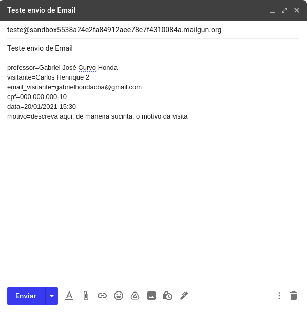

# Controle de Acesso Externo API
* Aplicação REST desenvolvida para fornecer dados sobre os visitantes do Instituto Federal de Mato Grosso.
* A API estará disponível no Heroku.

## Exemplo de cadastro de visita

## Tecnologias

| Dependência   | Versão               |
|---------------|----------------------|
| Spring Boot   | 2.4.1                |
| Kotlin        | 1.4.21               |
| Java          | 1.8                  |
| MailGun       | 1.9.2                |
| Postgres      | definida pelo spring | 
| H2            | definida pelo spring |

## Funcionalidades

| Descrição                               | Método | URI      |
|-----------------------------------------|--------|----------|
| Cria permissão ao enviar email          | POST   | /email |
| Realiza login                           | POST   | /login   |
| Consulta lista de permissões de entrada | GET    | /visitas |